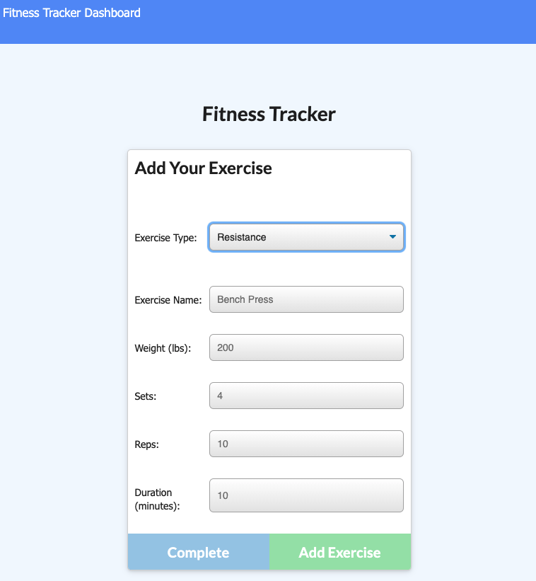

# Fitness Tracker

## Description

This app is meant to serve as a workout and exercise tracker. It allows the user to create a new workout and begin adding exercises to it. When you leave the app and come back, the user is given the option for add to previous workout or start a new one. The user will then see stats from the previous workout on the main page. The user can also visit the dashboard page which will give summaries to the user related to time and weight correlating to the user's recorded exercises.

## Table of Contents 

* [Installation](#installation)

* [Usage](#usage)

* [License](#license)

* [Contributing](#contributing)

* [Tests](#tests)

* [Questions](#questions)

* [Screenshots](#screenshots)

* [Demo](#demo)

## Installation

To install necessary dependencies, run the following command:

`
npm i
`

## Usage

In order to run this app on your local computer, you will need to install the dependcies. You will need to have MongoDB set up (you can go [here](https://docs.mongodb.com/mongocli/stable/install) for step by step instructions to install it on your local machine). You will then need to run `npm run seed` if you want to have the seed data in the app. Then you will just run `npm start` and the app will run on the localhost.

## License

This project is licensed under GPL-3.0.
  
## Contributing

Anyone.

## Tests

To run tests, run the following command:

`
n/a
`

## Questions

If you have any questions about the repo,please contact me at drfrank22@gmail.com.

## Screenshots

## Demo

